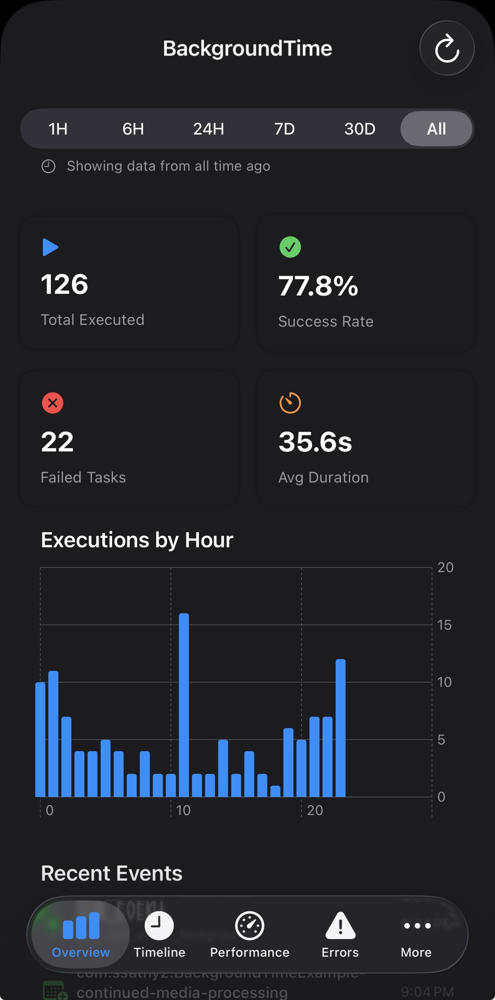
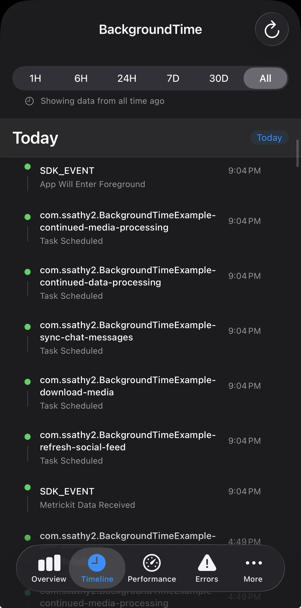
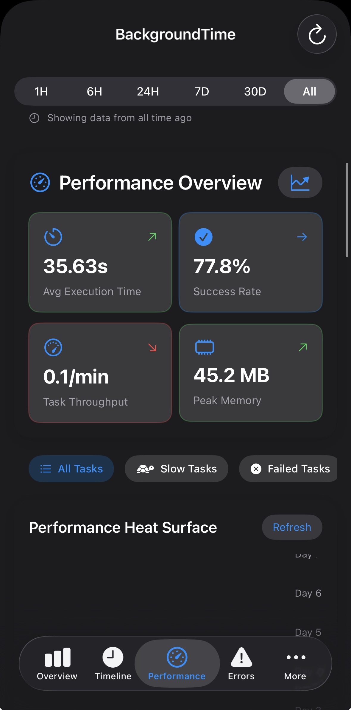
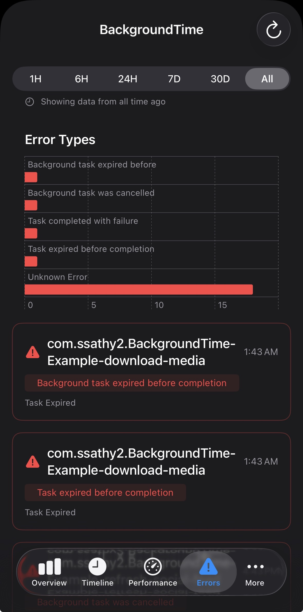

# BackgroundTime SDK

[](https://swift.org)
[](https://developer.apple.com)
[](LICENSE)
[](https://github.com/yourusername/BackgroundTime/releases)
[](https://github.com/ssathy2/BackgroundTime/actions/workflows/ci.yml)

A comprehensive iOS framework for monitoring and analyzing BackgroundTasks performance using method swizzling to provide deep insights into your app's background processing behavior.

> **⚠️ Beta Release**: This is a beta version. APIs may change before the stable release. Feedback and contributions are welcome!

## Overview

BackgroundTime SDK automatically tracks all BackgroundTasks API usage in your iOS app without requiring code changes. It uses method swizzling to intercept BGTaskScheduler calls and provides detailed analytics through a beautiful SwiftUI dashboard.



*The BackgroundTime dashboard provides comprehensive insights into your app's background task performance with real-time analytics and beautiful visualizations.*

## Features

### 🔍 **Automatic Tracking**
- **Zero-code integration** - Just initialize the SDK and it automatically tracks all background tasks
- **Method swizzling** - Intercepts all BGTaskScheduler and BGTask method calls
- **Comprehensive coverage** - Tracks scheduling, execution, completion, cancellation, and failures

### 📊 **Rich Analytics Dashboard**

<table>
<tr>
<td width="50%">


**Overview Tab** - Key statistics, success rates, and execution patterns with beautiful charts

</td>
<td width="50%">


**Timeline Tab** - Chronological view of all background task events with detailed filtering

</td>
</tr>
<tr>
<td width="50%">


**Performance Tab** - Advanced metrics including 3D visualizations and duration trends

</td>
<td width="50%">


**Errors Tab** - Detailed error analysis and failure pattern insights

</td>
</tr>
</table>

### 📈 **Detailed Metrics**
- **Execution Statistics** - Total scheduled/executed/completed/failed tasks
- **Performance Metrics** - Average duration, success rates, hourly patterns
- **System Context** - Battery level, low power mode, background app refresh status
- **Error Tracking** - Failure reasons, retry attempts, system constraint impacts

### 🌐 **Remote Dashboard Support**
- **Data Export** - JSON export for integration with web dashboards
- **Network Sync** - Optional remote dashboard synchronization
- **Real-time Monitoring** - Live updates for production app monitoring

## Quick Start

*Get started in under 30 seconds - just add the package and initialize!*

### 1. Add the Package

#### Swift Package Manager
```swift
dependencies: [
    .package(url: "https://github.com/yourusername/BackgroundTime", from: "0.1.0-beta")
]
```

#### Xcode
1. File → Add Package Dependencies
2. Enter: `https://github.com/yourusername/BackgroundTime`
3. Select "Up to Next Major Version" with `0.1.0-beta`
4. Add to your target

### 2. Initialize the SDK

In your App.swift file:

```swift
import BackgroundTime

@main
struct MyApp: App {
    init() {
        // Initialize BackgroundTime SDK - that's it!
        BackgroundTime.shared.initialize()
    }
    
    var body: some Scene {
        WindowGroup {
            ContentView()
        }
    }
}
```

### 3. Add the Dashboard (Optional)

*Simple one-line integration to add the powerful analytics dashboard to your app*

```swift
import BackgroundTime

struct ContentView: View {
    @State private var showDashboard = false
    
    var body: some View {
        NavigationView {
            YourAppContent()
                .toolbar {
                    ToolbarItem(placement: .navigationBarTrailing) {
                        Button("Dashboard") {
                            showDashboard = true
                        }
                    }
                }
        }
        .sheet(isPresented: $showDashboard) {
            if #available(iOS 16.0, *) {
                BackgroundTimeDashboard()
            }
        }
    }
}
```

### 4. UIKit Integration (Alternative)

For UIKit-based apps, you can present the dashboard using UIHostingController:

```swift
import UIKit
import SwiftUI
import BackgroundTime

class ViewController: UIViewController {
    
    override func viewDidLoad() {
        super.viewDidLoad()
        
        // Add dashboard button to navigation bar
        let dashboardButton = UIBarButtonItem(
            title: "Dashboard",
            style: .plain,
            target: self,
            action: #selector(showDashboard)
        )
        navigationItem.rightBarButtonItem = dashboardButton
    }
    
    @objc private func showDashboard() {
        guard #available(iOS 16.0, *) else {
            // Handle older iOS versions - perhaps show an alert
            let alert = UIAlertController(
                title: "Dashboard Unavailable",
                message: "The dashboard requires iOS 16.0 or later",
                preferredStyle: .alert
            )
            alert.addAction(UIAlertAction(title: "OK", style: .default))
            present(alert, animated: true)
            return
        }
        
        // Create SwiftUI dashboard wrapped in UIHostingController
        let dashboardView = BackgroundTimeDashboard()
        let hostingController = UIHostingController(rootView: dashboardView)
        
        // Configure presentation
        hostingController.modalPresentationStyle = .pageSheet
        
        // Present the dashboard
        present(hostingController, animated: true)
    }
}
```

### Alternative UIKit Approach with Navigation

```swift
import UIKit
import SwiftUI
import BackgroundTime

class MainViewController: UIViewController {
    
    @IBAction func dashboardButtonTapped(_ sender: UIButton) {
        guard #available(iOS 16.0, *) else { return }
        
        let dashboardView = BackgroundTimeDashboard()
        let hostingController = UIHostingController(rootView: dashboardView)
        
        // Present in navigation controller for better UX
        let navController = UINavigationController(rootViewController: hostingController)
        navController.modalPresentationStyle = .fullScreen
        
        // Add close button
        hostingController.navigationItem.leftBarButtonItem = UIBarButtonItem(
            barButtonSystemItem: .close,
            target: self,
            action: #selector(dismissDashboard)
        )
        
        present(navController, animated: true)
    }
    
    @objc private func dismissDashboard() {
        dismiss(animated: true)
    }
}
```

## Advanced Configuration

### Custom Configuration

```swift
let config = BackgroundTimeConfiguration(
    maxStoredEvents: 2000,           // Maximum events to store locally
    enableDetailedLogging: true      // Enable detailed logging
)

BackgroundTime.shared.initialize(configuration: config)
```

### Accessing Data Programmatically

```swift
// Get current statistics
let stats = BackgroundTime.shared.getCurrentStats()
print("Success rate: \(stats.successRate * 100)%")

// Get all events
let events = BackgroundTime.shared.getAllEvents()
print("Total events: \(events.count)")

// Export for external dashboard
let dashboardData = BackgroundTime.shared.exportDataForDashboard()
```

## Dashboard Metrics Explained

### Overview Tab
- **Total Executed**: Number of background tasks that started execution
- **Success Rate**: Percentage of tasks that completed successfully
- **Failed Tasks**: Number of tasks that failed or were cancelled
- **Average Duration**: Mean execution time for completed tasks
- **Executions by Hour**: 24-hour pattern showing when tasks typically run

### Performance Tab
- **Duration Trends**: Line chart showing execution times over time
- **Task-Specific Metrics**: Individual performance data for each task identifier
- **Efficiency Metrics**: Time between scheduling and execution

### Error Analysis
- **Error Types**: Categorized breakdown of failure reasons
- **System Constraints**: Impact of low power mode, background refresh settings
- **Failure Patterns**: When and why tasks are most likely to fail


## Example App Integration

The package includes a complete example app demonstrating integration in a social media/chat app context:

### Background Tasks Examples:
- **Feed Refresh** (`BGAppRefreshTask`) - Updates social media feed
- **Media Download** (`BGProcessingTask`) - Downloads images/videos  
- **Chat Sync** (`BGAppRefreshTask`) - Synchronizes chat messages

### Key Implementation Points:
```swift
// Register background tasks
BGTaskScheduler.shared.register(
    forTaskWithIdentifier: "refresh-social-feed",
    using: nil
) { task in
    await handleFeedRefresh(task as! BGAppRefreshTask)
}

// Schedule tasks
let request = BGAppRefreshTaskRequest(identifier: "refresh-social-feed")
request.earliestBeginDate = Date(timeIntervalSinceNow: 15 * 60)
try BGTaskScheduler.shared.submit(request)
```

The SDK automatically tracks all of these operations without any additional code!

## Dashboard Visualizations

### 🎯 **Comprehensive Analytics at Your Fingertips**

<table>
<tr>
<td width="33%">

**📊 Statistics Cards**
Quick overview with trend indicators, success rates, and performance metrics

</td>
<td width="33%">

**📈 Execution Patterns**
24-hour visualization showing when your tasks typically run

</td>
<td width="33%">

**🌟 3D Performance**
Advanced 3D surface plots for deep performance analysis

</td>
</tr>
</table>

## Architecture

### Method Swizzling
The SDK uses runtime method swizzling to intercept:
- `BGTaskScheduler.submit(_:)` - Task scheduling
- `BGTaskScheduler.cancel(taskRequestWithIdentifier:)` - Task cancellation
- `BGTask.setTaskCompleted(success:)` - Task completion
- Expiration handlers - Task timeouts

### Data Storage
- **Local Storage**: Events stored in UserDefaults with configurable limits
- **Memory Management**: Automatic cleanup of old events
- **Thread Safety**: Concurrent queues for safe data access
- **Persistence**: Data survives app termination and restart

### Network Integration
- **Optional Remote Sync**: Upload data to your dashboard backend
- **JSON Export**: Standard format for integration with existing tools
- **Configurable Endpoints**: Support for custom dashboard URLs
- **Error Handling**: Robust network error handling and retry logic

## Beta Feedback

We'd love your feedback on this beta release! Please:

- 🐛 [Report bugs](https://github.com/yourusername/BackgroundTime/issues/new?labels=bug)  
- 💡 [Suggest features](https://github.com/yourusername/BackgroundTime/issues/new?labels=enhancement)
- 📖 [Improve documentation](https://github.com/yourusername/BackgroundTime/issues/new?labels=documentation)
- ⭐ Star the repo if you find it useful!

## Requirements

- iOS 14.0+
- Xcode 12.0+
- Swift 5.3+

## Dashboard Requirements

The SwiftUI dashboard requires:
- iOS 16.0+ (for Charts framework)
- Falls back gracefully on older versions

## License

MIT License - see LICENSE file for details

## Contributing

1. Fork the repository
2. Create a feature branch
3. Make your changes
4. Add tests for new functionality
5. Submit a pull request


## Support

For questions, issues, or feature requests:
- Open an issue on GitHub
- Check the documentation
- Review the example app for integration patterns

---

**BackgroundTime SDK** - Making background task monitoring effortless and insightful. 🚀
